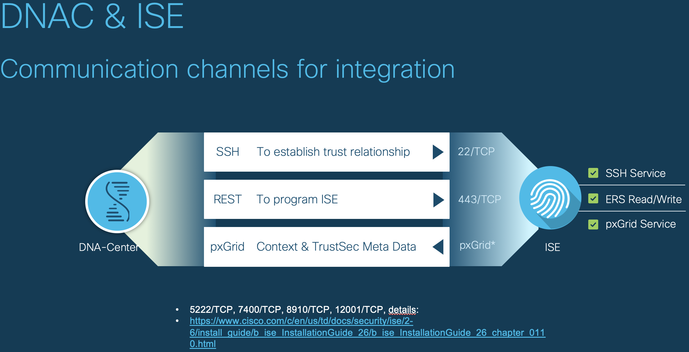

# Cisco DNA Center ISE Health Check
[](https://developer.cisco.com/codeexchange/github/repo/robertcsapo/cisco-dnac-ise-healthcheck)


*Cisco DNA-C and Cisco ISE Communication Health Check from Console*

Sometimes Cisco DNA-C fails to communicate with Cisco ISE with Error on Application level.  
This script helps you to verify that the communication paths between Cisco DNA-C and Cisco ISE is working (non-Application level)

## Demo


## Requirements

* Cisco DNA Center Console access (_ssh maglev@<dnac-ip-address> -p 2222_)
* Internet Connectivity on DNA Center (Cloud Enabled)
  - DNA Center downloads this container image from Public Docker Registry (docker.io)

## Usage

Login to Cisco DNA-C
* ```ssh maglev@<dnac-ip-address> -p 2222```

Run script
* ```docker run -it --rm robertcsapo/cisco-dnac-ise-healthcheck && docker rmi robertcsapo/cisco-dnac-ise-healthcheck```

Enter Cisco ISE FQDN (then hit ENTER)
* ```Enter host (FQDN): cisco-ise.example.com```

### Automation

Run script with host flag
* ```docker run -it --rm robertcsapo/cisco-dnac-ise-healthcheck -host cisco-ise.example.com && docker rmi robertcsapo/cisco-dnac-ise-healthcheck```

## Installation

If you need to manually build the script on the host.  
(Important that you predownload golang:1.9.2-alpine3.7 from docker.io)  
```
docker pull golang:1.9.2-alpine3.7
```

### Build
* ```docker build -t robertcsapo/cisco-dnac-ise-healthcheck .```

## Technologies & Frameworks Used

**Cisco Products & Services:**

- Cisco DNA Center
- Cisco ISE

**Tools & Frameworks:**

- Golang (1.9.2)


## Authors & Maintainers

- Robert Csapo <rcsapo@cisco.com>

## Cisco ISE Port Reference
#### Overview

#### Cisco ISE 2.6 Installation Guide

_Ports Used by the Administration Nodes_
* _Administration_
  * _HTTP: TCP/80, HTTPS: TCP/443 (TCP/80 redirected to TCP/443; not configurable)_
  * _SSH Server: TCP/22_
  * _External RESTful Services (ERS) REST API: TCP/9060_

_Ports Used by the pxGrid Service Node_

* _Administration_
  * _SSL: TCP/5222 (Inter-Node Communication)_
  * _SSL: TCP/7400 (Node Group Communication)_
* _pxGrid Subscribers_
  * _TCP/8910_

(Source: https://www.cisco.com/c/en/us/td/docs/security/ise/2-6/install_guide/b_ise_InstallationGuide_26/b_ise_InstallationGuide_26_chapter_0110.html)

## License

This project is licensed to you under the terms of the [Cisco Sample
Code License](./LICENSE).
